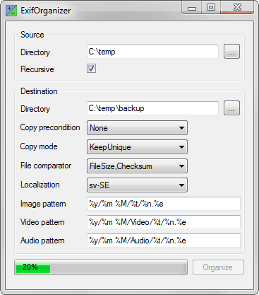

ExifOrganizer
=============

Organize image collections based on Exif data with customizable destination paths.
### Status
Currently in development of first beta version.

## Description
The idea is to select a source path to be organized, where media files (mainly images, but also videos and music) is gathered from. Those files are then copied and structured into a destination path. How the media files are organized is configrable via a graphical user interface (GUI) or by command line interface (CLI) for scripting.

## Screenshot

## Environment
Everything is written in C# 6.0 and .NET 4.5 using Visual Studio 2017. There are no external dependencies.

## License
This project is licensed under GPLv3.

